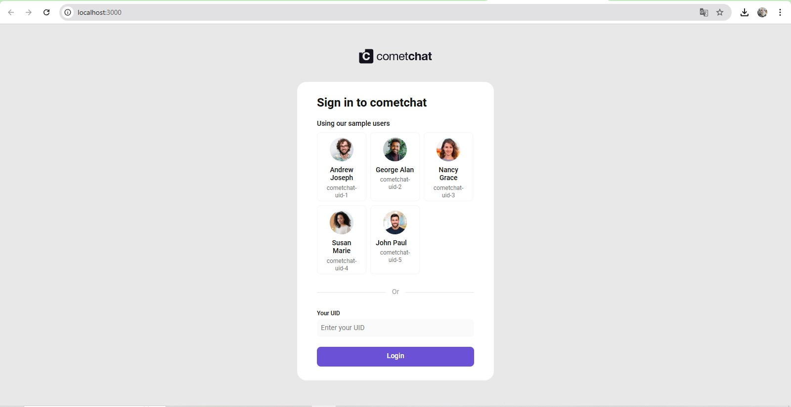
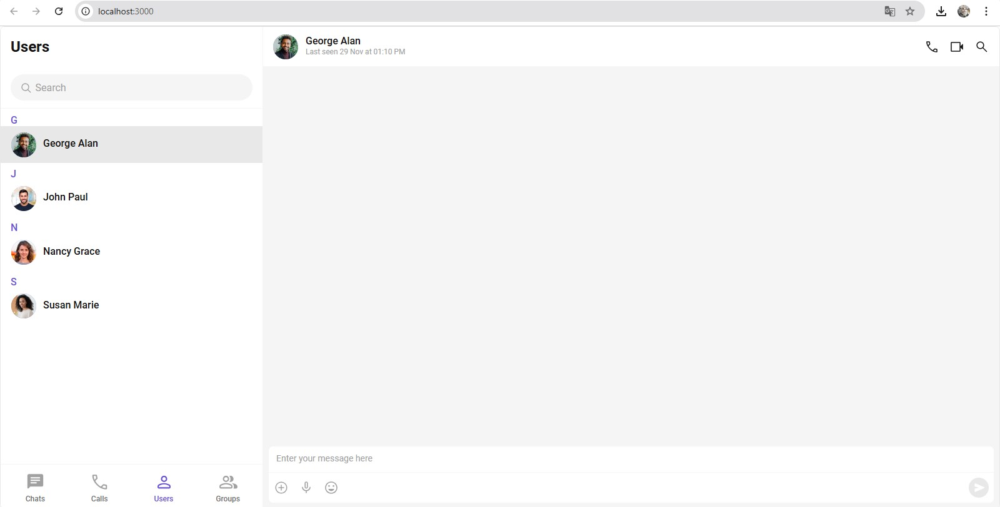
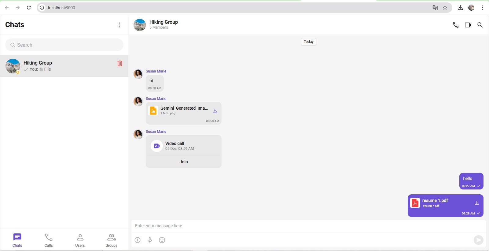

# CometChat React UI Kit Integration – Internship Assignment

## Overview

This project demonstrates the integration and evaluation of CometChat’s React UI Kit Builder as part of the ReactJS Development Internship assignment.

The purpose of this assignment is to analyze the developer experience, identify usability issues, and suggest improvements across the CometChat dashboard, UI Kit Builder, documentation, and actual UI Kit implementation.

---

## Tech Stack

- React.js
- TypeScript
- Vite / Create React App
- CometChat React UI Kit

---

## Setup Instructions

1. Clone the repository
2. Install dependencies
   npm install

markdown
Copy code 3. Add CometChat credentials in `src/main.tsx` / `src/index.tsx` 4. Run the application
npm run dev

nginx
Copy code
or
npm start

yaml
Copy code

---

## Screenshots

### Chat Interface

### User List

### Messaging Screen

---

## Notes

The project runs successfully with correct credentials. The UI Kit provides a quick way to integrate chat functionality, though some configuration and documentation improvements are suggested (detailed in the PDF report).

---

## Author

Ambar Ubale
